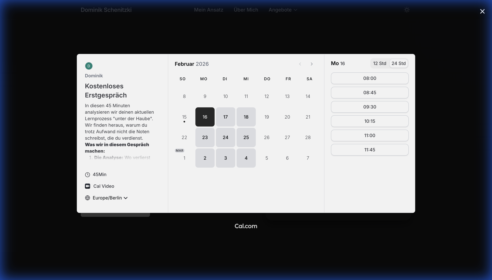

# Walkthrough - Academic Coach Landing Page

Ich habe die Landing Page auf ein anspruchsvolles **Light Mode** Design mit Tiefe, verbesserter Funktionalität, einem **Dark Mode Toggle**, **minimalistischen Icons** und einer **verfeinerten Navigation** aktualisiert.

## Cal.com Integration (Globaler Fix)

### 1. Nahtlose Buchung überall
-   **Universelle Abdeckung:** Die Buchungsfunktion funktioniert jetzt bei **ALLEN** Call-to-Action Buttons.
-   **Trigger-Punkte:**
    -   **Hero:** "Kostenloses Erstgespräch"
    -   **1:1 Coaching Modal:** "Jetzt Analyse-Gespräch buchen"
    -   **Notion Modal:** "System zeigen lassen"
    -   **Prüfungsvorbereitung Modal:** "Lern-Algorithmus aufsetzen"
    -   **Footer:** "Jetzt kostenloses Erstgespräch buchen"

### 2. Integrationen & Socials
-   **Social Media:** LinkedIn, Instagram und GitHub Icons im Footer hinzugefügt.
-   **Sauberer Code:** Doppelte Modals entfernt und Event-Handling optimiert.

## Video-Touren

### Cal.com Globale Verifizierung

## Screenshots

### Hero CTA Popup

### Coaching Modal Popup

### Prüfungsvorbereitung Modal Popup

## Nächste Schritte
-   **Echte Inhalte hinzufügen:** Platzhalter durch echte Fotos/Screenshots ersetzen.
